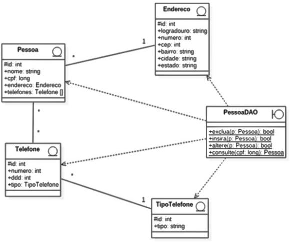

# MECANISMO-DE-ACESSO-A-UM-BANCO-DE-DADOS-ASP.NET

Este é um projeto que fiz na faculdade de um sistema em C#, utilizando o framework ASP.NET.
O objetivo é desenvolver um mecanismo de acesso a um banco de dados e uma interface que de ao usuário as funções CRUD (Create, Read, Updade e Delete).

### O DIAGRAMA DE CLASSES

As classes desenvolvidas foram baseadas em um diagrama de classes proposto pela instituição. E seus devidos relacionamentos.

  

A classe PessoaDAO foi feita utilizando o padrão repository pattern, separando a parte lógica da camada de acesso aos dados do banco. Não foi proposto a utilização deste pela faculdade, e sim apenas minha escolha. É nesta classe que estão contidos os métedos CRUD.
